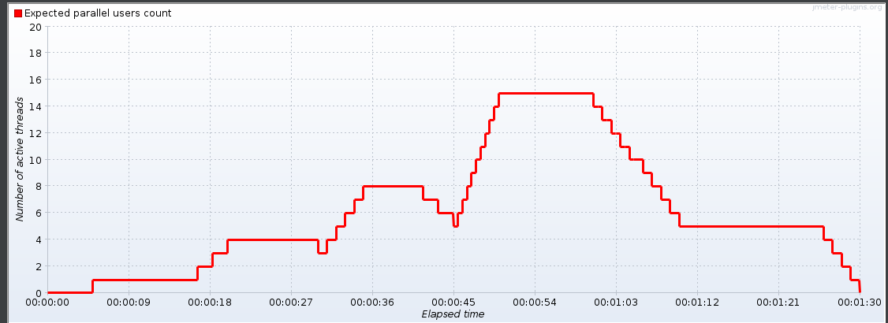
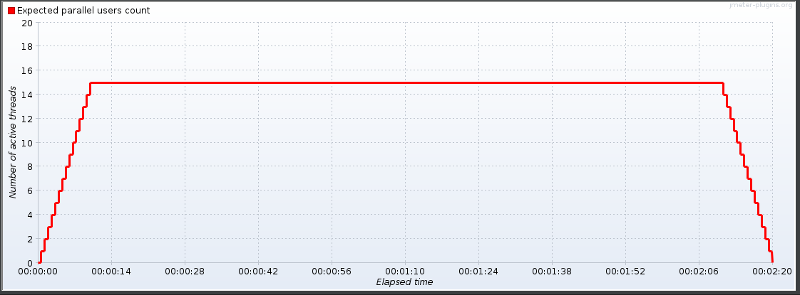
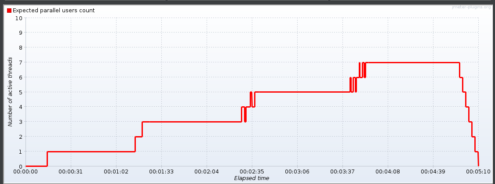

# Prerequisites
- [jmeter v5.5](https://jmeter.apache.org/download_jmeter.cgi)
- JMeter plugin [Ultimate Thread Group](https://jmeter-plugins.org/wiki/UltimateThreadGroup/)

# How to run scripts?

Run scripts/runLoadScript.sh (you may need to adjust parameters).

# Pre-prepared scripts

## JMeter test plans

Five test plans for JMeter were prepared, and they are included in test-plans folder.

For single user, following requests are made:
- list all owners
- add owner
- get owner details
- update owner
- add pet (randomly - add two pets)
- update pet
- list all veterinarians
- add veterinarian visit (randomly - add two visits)

Test plans have different number of parallel users, and differn in how the number of user changes in time. The test schedule for plans can be seen below:

##### Test plan 1:

##### Test plan 2:

##### Test plan 3:

##### Test plan 4:

##### Test plan 5:

# How to modify scripts?

- Run GUI for JMeter
- Open script you want to modify
- To modify load, go to **jp@gc - Ultimate Thred Group**, then adjust load in **Threads Schedule**:

# Running tests and extracting telemetry
`export TEST_NUMBER=1`
`./scripts/runLoadScript.sh`
`./scripts/testExtract.sh`

Results of the tests will be in a directory named `test-data`.
