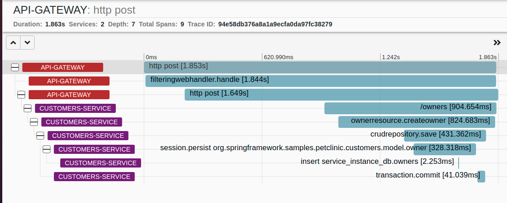
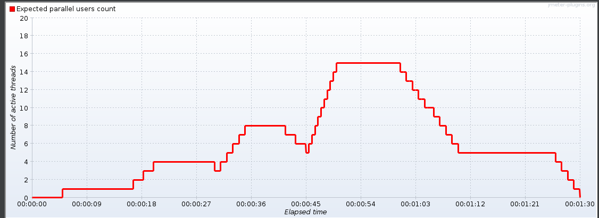
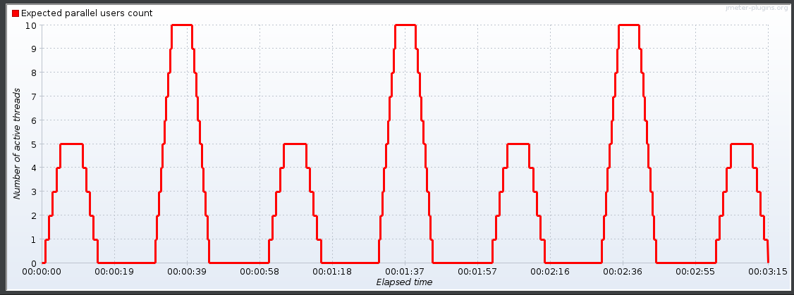
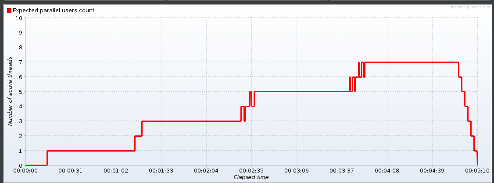
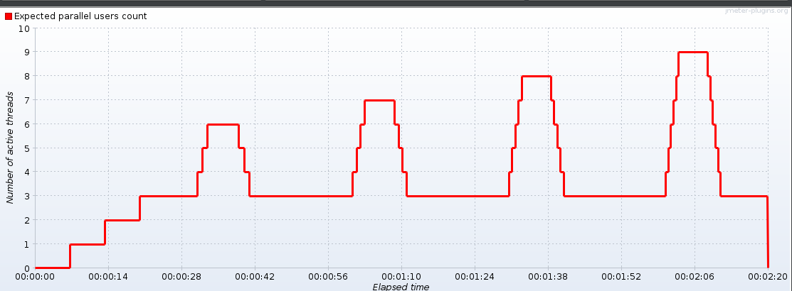

# Distributed version of the Spring PetClinic - adapted for AWS and Kubernetes 

[](https://travis-ci.org/spring-petclinic/spring-petclinic-cloud/) [](https://opensource.org/licenses/Apache-2.0)

This microservices branch was initially derived from the [microservices version](https://github.com/spring-petclinic/spring-petclinic-microservices) to demonstrate how to split sample Spring application into [microservices](http://www.martinfowler.com/articles/microservices.html).
To achieve that goal we use Spring Cloud Gateway, Spring Cloud Circuit Breaker, Spring Cloud Config, Spring Cloud Sleuth, Resilience4j, Micrometer and the Eureka Service Discovery from the [Spring Cloud Netflix](https://github.com/spring-cloud/spring-cloud-netflix) technology stack. While running on Kubernetes, some components (such as Spring Cloud Config and Eureka Service Discovery) are replaced with Kubernetes-native features such as config maps and Kubernetes DNS resolution.

## Deployment on AWS with Kubernetes

### Prerequisites
- [aws-cli v2.5.8](https://docs.aws.amazon.com/cli/latest/userguide/getting-started-install.html)
- [kubectl v1.23.6](https://kubernetes.io/docs/tasks/tools/)
- [istio v1.9.0](https://istio.io/latest/docs/setup/getting-started/#download)
- install **helm v3.8.0** - `./get_helm.sh --version v3.8.0`

### Deployment
1. Start **AWS** lab and paste **AWS CLI** (from **AWS Details**) credentials to `~/.aws/credentials`
2. Modify `./scripts/deploy.sh` script.
   Set ARN of [LabRole](https://us-east-1.console.aws.amazon.com/iamv2/home?region=us-east-1#/roles/details/LabRole?section=permissions) to `LAB_ROLE` variable.
   Set two [subnet ID](https://us-east-1.console.aws.amazon.com/vpc/home?region=us-east-1#subnets:) to `SUBNET_A` and `SUBNET_B` variables.
3. Run `./scripts/deploy.sh` script

### Deploying own service images to Docker Hub
The current version of services were deployed to public Docker Hub. If any changes
are made to services, they need to be redeployed.

How to do that?

1. Make sure you're already logged in by running `docker login <endpoint>` or `docker login` if you're just targeting Docker hub.
2. Setup an env variable to target your Docker registry, e.g.
`export REPOSITORY_PREFIX=iffern`
3. Run `mvn spring-boot:build-image -Pk8s -DREPOSITORY_PREFIX=${REPOSITORY_PREFIX} && ./scripts/pushImages.sh`
4. Change `REPOSITORY_PREFIX` in `./scripts/deploy.sh` script.

### Telemetry
#### Metrics
``istioctl dashboard prometheus``
#### Traces
``istioctl dashboard zipkin``

## Extracting traces and metrics from Kubernetes

### Extracting traces
Once the app is running in AWS, you can extract traces from all instrumented services.

#### Steps
1. Run `istioctl dashboard zipkin`. This will forward Zipkin to your local port.
2. Run `python ./scripts/data-extraction/extract-traces.py`. The script will save all traces that Zipkin collected in JSON files named by the services that produced the traces.

#### Trace data format
The trace format is compliant with the OpenTelemetry standard.
A trace is a collection of spans. A span represents a unit of work done by a particular service.
It provides details regarding a particular request, such as operation details (address of the request, type of SQL statement etc.)
as well as some info about the runtime environment of the process that performed such request (OS, opentelemetry versions, k8s info such as node name and pod name).

In general, a span contains:
* traceId, id
* timestamp
* duration
* annotations
* tags

A full description of traces extracted from zipkin is available [here](https://zipkin.io/zipkin-api/#/).
A more general description of the OpenTelemetry format is available [here](https://github.com/open-telemetry/opentelemetry-specification/blob/main/specification/overview.md).
#### Example trace
Adding a new pet owner results in the following trace (visualization from Zipkin):

Example span from the trace (the whole trace available [here](docs/add-owner.json):
```json
  {
    "traceId": "94e58db376a8a1a9ecfa0da97fc38279",
    "parentId": "2ad11349b1eaf1b9",
    "id": "a07ad9a1c37c20da",
    "kind": "CLIENT",
    "name": "insert service_instance_db.owners",
    "timestamp": 1656517226329615,
    "duration": 2253,
    "localEndpoint": {
      "serviceName": "customers-service"
    },
    "tags": {
      "container.id": "86ad28c4ce3abd57dda1acbaec4ffdbb17f9a2431c0cb476c11639d239d292ab",
      "db.connection_string": "mysql://customers-db-mysql.spring-petclinic.svc.cluster.local:3306",
      "db.name": "service_instance_db",
      "db.operation": "INSERT",
      "db.sql.table": "owners",
      "db.statement": "insert into owners (address, city, first_name, last_name, telephone) values (?, ?, ?, ?, ?)",
      "db.system": "mysql",
      "db.user": "root",
      "host.arch": "amd64",
      "host.name": "customers-service-b4f78fd79-4vqt2",
      "k8s.container.name": "customers-service",
      "k8s.deployment.name": "customers-service",
      "k8s.namespace.name": "spring-petclinic",
      "k8s.node.name": "ip-172-31-89-40.ec2.internal",
      "k8s.pod.name": "customers-service-b4f78fd79-4vqt2",
      "k8s.replicaset.name": "customers-service-b4f78fd79",
      "net.peer.name": "customers-db-mysql.spring-petclinic.svc.cluster.local",
      "os.description": "Linux 5.4.196-108.356.amzn2.x86_64",
      "os.type": "linux",
      "otel.library.name": "io.opentelemetry.jdbc",
      "otel.library.version": "1.11.1",
      "process.command_line": "/layers/paketo-buildpacks_bellsoft-liberica/jre:bin:java -javaagent:/otel-auto-instrumentation/javaagent.jar -Djava.security.properties=/layers/paketo-buildpacks_bellsoft-liberica/java-security-properties/java-security.properties -XX:+ExitOnOutOfMemoryError -XX:ActiveProcessorCount=2 -XX:MaxDirectMemorySize=10M -Xmx713567K -XX:MaxMetaspaceSize=186272K -XX:ReservedCodeCacheSize=240M -Xss1M -XX:+UnlockDiagnosticVMOptions -XX:NativeMemoryTracking=summary -XX:+PrintNMTStatistics -Dorg.springframework.cloud.bindings.boot.enable=true",
      "process.executable.path": "/layers/paketo-buildpacks_bellsoft-liberica/jre:bin:java",
      "process.pid": "1",
      "process.runtime.description": "BellSoft OpenJDK 64-Bit Server VM 11.0.15.1+2-LTS",
      "process.runtime.name": "OpenJDK Runtime Environment",
      "process.runtime.version": "11.0.15.1+2-LTS",
      "telemetry.auto.version": "1.11.1",
      "telemetry.sdk.language": "java",
      "telemetry.sdk.name": "opentelemetry",
      "telemetry.sdk.version": "1.11.0",
      "thread.id": "56",
      "thread.name": "http-nio-8080-exec-10"
    }
  }
```

### Extracting metrics
Once the app is running in AWS, you can extract metrics from all services and containers.

#### Steps
1. Run `istioctl dashboard prometheus`. This will forward Prometheus to your local port.
2. Run `python ./scripts/data-extraction/extract-metrics.py -t [time] -ho [Prometheus host] -om [metrics metadata file name] -ov [metrics values file name]`.
   The script will save all metrics that Prometheus collected in two JSON files: one with metadata metrics,
   one with metadata values. Metrics for all services will be collected in those two files.

#### Collected metrics
The metrics collected from Prometheus are limited to application metrics, database metrics and some container metrics.
In particular, we gather metrics with the following prefix:
* `application_` - apps runtime metrics
* `container_` - container metrics (only related to apps' containers)
* `disk_` - disk in containers metrics ((only related to apps' containers))
* `envoy_` - Envoy metrics (only related to apps' containers)
* `executor_` - task execution metrics
* `hikaricp_` - Hikari-specific data source metrics
* `http_` - HTTP client metrics
* `istio_` - Istio metrics (only related to apps' containers)
* `jdbc_` - data source metrics
* `jvm_` - JVM metrics
* `tomcat_` - Tomcat metrics
* `mysql_` - MYSQL metrics

More about Java and Spring Boot specific metrics here: https://docs.spring.io/spring-boot/docs/current/reference/html/actuator.html#actuator.metrics.supported

### Running tests and extracting telemetry
`export TEST_NUMBER=1`

`./scripts/runLoadScript.sh`

`./scripts/testExtract.sh`

Results of the tests will be in a directory named `test-data`.

## Run JMeter load for Kubernetes deployment on AWS

### Prerequisites
- [jmeter v5.5](https://jmeter.apache.org/download_jmeter.cgi)
- JMeter plugin [Ultimate Thread Group](https://jmeter-plugins.org/wiki/UltimateThreadGroup/)

### How to run scripts?

Run `./scripts/runLoadScript.sh` (you may need to adjust parameters).

### Pre-prepared scripts

#### JMeter test plans

Five test plans for JMeter were prepared, and they are included in test-plans folder.

For single user, following requests are made:
- list all owners
- add owner
- get owner details
- update owner
- add pet (randomly - add two pets)
- update pet
- list all veterinarians
- add veterinarian visit (randomly - add two visits)

Test plans have different number of parallel users, and differn in how the number of user changes in time. The test schedule for plans can be seen below:

##### Test plan 1:



##### Test plan 2:



##### Test plan 3:


##### Test plan 4:



##### Test plan 5:



#### How to modify scripts?

- Run GUI for JMeter
- Open script you want to modify
- To modify load, go to **jp@gc - Ultimate Thred Group**, then adjust load in **Threads Schedule**:


## Understanding the Spring Petclinic application

[See the presentation of the Spring Petclinic Framework version](http://fr.slideshare.net/AntoineRey/spring-framework-petclinic-sample-application)


## Starting services locally without Docker

Every microservice is a Spring Boot application and can be started locally using IDE 
or `../mvnw spring-boot:run -Plocal` command.
Remember to enable the `local` Maven profile.

Please note that supporting services (Config and Discovery Server) must be started before any other application (Customers, Vets, Visits and API).
Startup of Tracing server, Admin server, Grafana and Prometheus is optional.
If everything goes well, you can access the following services at given location:

* Discovery Server - http://localhost:8761
* Config Server - http://localhost:8888
* AngularJS frontend (API Gateway) - http://localhost:8080
* Customers, Vets and Visits Services - random port, check Eureka Dashboard 
* Tracing Server (Zipkin) - http://localhost:9411/zipkin/ (we use [openzipkin](https://github.com/openzipkin/zipkin/tree/master/zipkin-server))
* Admin Server (Spring Boot Admin) - http://localhost:9090
* Grafana Dashboards - http://localhost:3000
* Prometheus - http://localhost:9091

You can tell Config Server to use your local Git repository by using `native` Spring profile and setting
`GIT_REPO` environment variable, for example:
`-Dspring.profiles.active=native -DGIT_REPO=/projects/spring-petclinic-microservices-config`

## Starting services locally with docker-compose

In order to start entire infrastructure using Docker, you have to build images by executing `./mvnw clean install -P buildDocker` 
from a project root. Once images are ready, you can start them with a single command
`docker-compose up`. Containers startup order is coordinated with [`dockerize` script](https://github.com/jwilder/dockerize). 
After starting services it takes a while for API Gateway to be in sync with service registry,
so don't be scared of initial Spring Cloud Gateway timeouts. You can track services availability using Eureka dashboard
available by default at http://localhost:8761.

The `master` branch uses an  Alpine linux  with JRE 8 as Docker base. You will find a Java 11 version in the `release/java11` branch.

*NOTE: Under MacOSX or Windows, make sure that the Docker VM has enough memory to run the microservices. The default settings
are usually not enough and make the `docker-compose up` painfully slow.*


## In case you find a bug/suggested improvement for Spring Petclinic Microservices

Our issue tracker is available here: https://github.com/spring-petclinic/spring-petclinic-cloud/issues

## Database configuration

In its default configuration, Petclinic uses an in-memory database (HSQLDB) which gets populated at startup with data.
A similar setup is provided for MySql in case a persistent database configuration is needed.
Dependency for Connector/J, the MySQL JDBC driver is already included in the `pom.xml` files.

### Start a MySql database

You may start a MySql database with docker:

```
docker run -e MYSQL_ROOT_PASSWORD=petclinic -e MYSQL_DATABASE=petclinic -p 3306:3306 mysql:5.7.8
```
or download and install the MySQL database (e.g., MySQL Community Server 5.7 GA), which can be found here: https://dev.mysql.com/downloads/

### Use the Spring 'mysql' profile

To use a MySQL database, you have to start 3 microservices (`visits-service`, `customers-service` and `vets-services`)
with the `mysql` Spring profile. Add the `--spring.profiles.active=mysql` as programm argument.

By default, at startup, database schema will be created and data will be populated.
You may also manually create the PetClinic database and data by executing the `"db/mysql/{schema,data}.sql"` scripts of each 3 microservices. 
In the `application.yml` of the [Configuration repository], set the `initialization-mode` to `never`.

If you are running the microservices with Docker, you have to add the `mysql` profile into the (Dockerfile)[docker/Dockerfile]:
```
ENV SPRING_PROFILES_ACTIVE docker,mysql
```
In the `mysql section` of the `application.yml` from the [Configuration repository], you have to change 
the host and port of your MySQL JDBC connection string. 

## Custom metrics monitoring

Grafana and Prometheus are included in the `docker-compose.yml` configuration, and the public facing applications
have been instrumented with [MicroMeter](https://micrometer.io) to collect JVM and custom business metrics.

A JMeter load testing script is available to stress the application and generate metrics: [petclinic_test_plan.jmx](spring-petclinic-api-gateway/src/test/jmeter/petclinic_test_plan.jmx)


### Using Prometheus

* Prometheus can be accessed from your local machine at http://localhost:9091

### Using Grafana with Prometheus

* An anonymous access and a Prometheus datasource are setup.
* A `Spring Petclinic Metrics` Dashboard is available at the URL http://localhost:3000/d/69JXeR0iw/spring-petclinic-metrics.
You will find the JSON configuration file here: [docker/grafana/dashboards/grafana-petclinic-dashboard.json]().
* You may create your own dashboard or import the [Micrometer/SpringBoot dashboard](https://grafana.com/dashboards/4701) via the Import Dashboard menu item.
The id for this dashboard is `4701`.

### Custom metrics
Spring Boot registers a lot number of core metrics: JVM, CPU, Tomcat, Logback... 
The Spring Boot auto-configuration enables the instrumentation of requests handled by Spring MVC.
All those three REST controllers `OwnerResource`, `PetResource` and `VisitResource` have been instrumented by the `@Timed` Micrometer annotation at class level.

* `customers-service` application has the following custom metrics enabled:
  * @Timed: `petclinic.owner`
  * @Timed: `petclinic.pet`
* `visits-service` application has the following custom metrics enabled:
  * @Timed: `petclinic.visit`

## Looking for something in particular?

| Spring Cloud components         | Resources  |
|---------------------------------|------------|
| Configuration server            | [Config server properties](spring-petclinic-config-server/src/main/resources/application.yml) and [Configuration repository] |
| Service Discovery               | [Eureka server](spring-petclinic-discovery-server) and [Service discovery client](spring-petclinic-vets-service/src/main/java/org/springframework/samples/petclinic/vets/VetsServiceApplication.java) |
| API Gateway                     | [Spring Cloud Gateway starter](spring-petclinic-api-gateway/pom.xml) and [Routing configuration](/spring-petclinic-api-gateway/src/main/resources/application.yml) |
| Docker Compose                  | [Spring Boot with Docker guide](https://spring.io/guides/gs/spring-boot-docker/) and [docker-compose file](docker-compose.yml) |
| Circuit Breaker                 | [Resilience4j fallback method](spring-petclinic-api-gateway/src/main/java/org/springframework/samples/petclinic/api/boundary/web/ApiGatewayController.java)  |
| Grafana / Prometheus Monitoring | [Micrometer implementation](https://micrometer.io/), [Spring Boot Actuator Production Ready Metrics] |

 Front-end module  | Files |
|-------------------|-------|
| Node and NPM      | [The frontend-maven-plugin plugin downloads/installs Node and NPM locally then runs Bower and Gulp](spring-petclinic-ui/pom.xml)  |
| Bower             | [JavaScript libraries are defined by the manifest file bower.json](spring-petclinic-ui/bower.json)  |
| Gulp              | [Tasks automated by Gulp: minify CSS and JS, generate CSS from LESS, copy other static resources](spring-petclinic-ui/gulpfile.js)  |
| Angular JS        | [app.js, controllers and templates](spring-petclinic-ui/src/scripts/)  |


## Interesting Spring Petclinic forks

The Spring Petclinic master branch in the main [spring-projects](https://github.com/spring-projects/spring-petclinic)
GitHub org is the "canonical" implementation, currently based on Spring Boot and Thymeleaf.

This [spring-petclinic-cloud](https://github.com/spring-petclinic/spring-petclinic-cloud/) project is one of the [several forks](https://spring-petclinic.github.io/docs/forks.html) 
hosted in a special GitHub org: [spring-petclinic](https://github.com/spring-petclinic).
If you have a special interest in a different technology stack
that could be used to implement the Pet Clinic then please join the community there.


# Contributing

The [issue tracker](https://github.com/spring-petclinic/spring-petclinic-microservices/issues) is the preferred channel for bug reports, features requests and submitting pull requests.

For pull requests, editor preferences are available in the [editor config](.editorconfig) for easy use in common text editors. Read more and download plugins at <http://editorconfig.org>.


[Configuration repository]: https://github.com/spring-petclinic/spring-petclinic-microservices-config
[Spring Boot Actuator Production Ready Metrics]: https://docs.spring.io/spring-boot/docs/current/reference/html/production-ready-metrics.html
